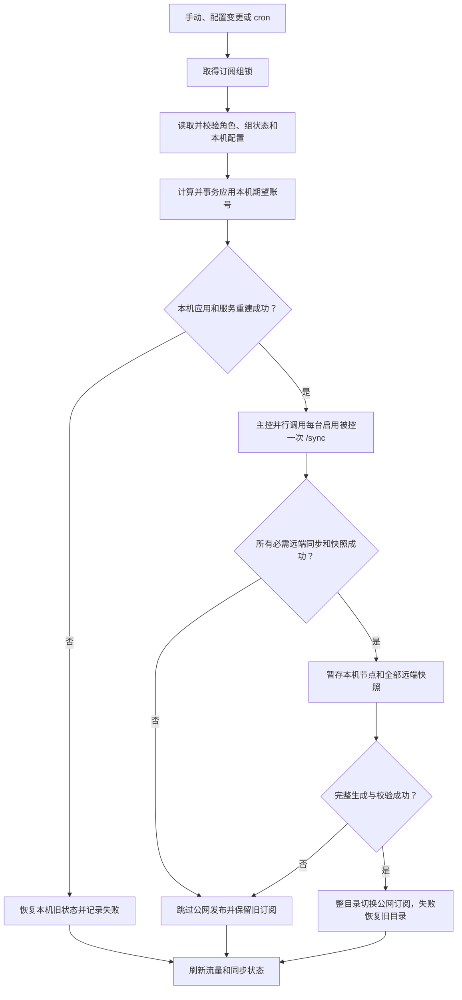

# 主控/被控订阅同步与菜单简化计划

状态：本地实施、自动回归和合并态复验已完成；真实双被控、混合版本和 systemd/WireGuard 现场验收尚未执行。

基线：`main` / `68d6bec`（`v2.3.5`）。

实施提交：`1eb01d0`（`feat(subscription): unify sync controls and menus`），已快进合并到 `main`；尚未推送或发布。

## 结论

本计划把当前同步行为收敛为“一条完整同步链路、一个自动同步开关、一个最终发布门”。

- 手动、菜单变更和 cron 只作为不同触发器，最终都调用同一个完整同步入口。
- `.sync.enabled` 成为唯一自动同步开关；开启时菜单变更立即同步，cron 负责定时兜底和失败重试；关闭时只允许手动同步。
- 不再提供独立的“事件同步”和“远程同步”开关。远端是否参与由主控角色、WireGuard 控制面运行状态和每个远端服务器源自身的 `enabled` 状态决定；服务器源管理提供单来源启停。
- 主控是唯一期望状态来源；被控不主动同步，只响应主控发起的认证 `/sync`。
- 被控正式 `/sync` 固定在应用账号状态后返回该来源的完整订阅快照。
- 主控只有在本机阶段成功、所有必需远端快照完整且订阅生成成功时，才通过完整暂存、整目录切换和失败恢复发布公网订阅。
- 任一必需阶段失败时保留旧公网订阅，不发布部分结果；下次手动、事件或 cron 同步继续收敛。
- 不实现跨机器回滚。主控和每台被控各自保证本机事务，公网发布作为最终提交门。
- 限额自动处理保留独立开关，因为它会停用订阅对象，风险不同于普通同步。

## 当前审计事实

### 当前入口已经统一

当前手动、事件和 cron 最终都能进入 `runSubscriptionGroupSync()`，这是应继续保留的正确边界：

- 手动入口直接调用 `runSubscriptionGroupSync()`。
- 菜单变更通过 `runSubscriptionEventSyncIfEnabled()` 调用同一入口。
- cron 通过 `runSubscriptionGroupSyncCron()` 检查 `.sync.enabled` 后调用同一入口。
- 顶层 `subscriptionGroupsWithLock` 保证同一订阅组不会并发写状态、配置和输出。

本计划不新增第二套同步器、后台队列、事件总线或事务日志。

### 剩余行为复杂度

当前 `.sync` 同时存在三个同步相关开关：

| 字段 | 当前作用 | 问题 |
| --- | --- | --- |
| `.sync.enabled` | 控制 cron | 名称像总开关，实际只控制定时触发 |
| `.sync.event_enabled` | 控制菜单变更后的即时同步 | 可与 cron 开关形成互相矛盾的组合 |
| `.sync.remote_enabled` | 控制完整同步是否包含被控 | 与每个服务器源自己的 `enabled` 重复 |

这会产生难以解释的状态，例如“自动同步关闭但变更仍立即同步”“自动同步开启但永远不更新被控”“服务器源启用但被全局远程开关跳过”。

### 当前数据链路接近正确目标

`v2.3.5` 已完成下列基础能力，本计划不重新设计：

- 主控对每台新版被控只执行一次 `/sync`。
- 被控可以在同步响应中返回全部期望账号的 default、Clash Meta 和 sing-box 快照。
- 主控校验远端账号集合、字段类型和 sing-box 对象结构。
- 本机节点和远端节点在暂存目录合并。
- 公网订阅通过完整暂存、整目录切换和失败恢复发布，不逐文件暴露半成品。
- 远端缺失账号、返回 `null`、格式错误或发布失败时保留旧公网目录。
- 旧被控缺少批量快照时仍可回退逐账号 `/subscribe`。

本计划重点删除行为开关、菜单分叉和正式 `/sync` 的可选快照模式，不削弱上述校验与发布保护。

## 目标与非目标

### 目标

1. 让用户只需要理解“自动同步开关、同步间隔、立即同步、状态与排障、用量与限额”。
2. 让同一种订阅变更在手动、事件和 cron 三种触发方式下得到相同结果。
3. 让启用的被控来源始终参加主控完整同步，不再受隐藏的组级远程开关影响。
4. 让主控和被控之间的正式同步请求同时完成账号收敛和订阅快照返回。
5. 让远端失败只产生一个明确失败结果，不再继续尝试注定失败的公网发布并叠加第二条错误。
6. 把高频命令放在首层菜单，把计划、健康、失败明细和 cron 原文收进“状态与排障”。
7. 保持旧被控滚动升级能力，并给出删除旧 `/subscribe` 回退的明确门槛。

### 非目标

- 不新增数据库、消息队列、守护进程、锁文件或依赖。
- 不实现跨主控和多台被控的分布式事务。
- 不在网络失败后尝试远程反向回滚已经成功应用的被控账号。
- 不改变 WireGuard 邀请、回执、Peer、控制 Token 或公网订阅 TLS 方案。
- 不重新设计旧 HTTPS 服务器源的公网订阅格式；新版控制同步返回的批量快照优先于传输方式，只有兼容回退按 WireGuard/HTTPS 区分。
- 不改变订阅 URL、账号命名、Salt、default、Clash Meta 或 sing-box 公网格式。
- 不把限额自动处理并入普通自动同步开关。
- 不在本任务手工修改 `SCRIPT_VERSION`。
- 不为减少函数数量而删除输入校验、备份恢复、锁或原子发布。

## 固定行为合同

### 角色职责

| 角色 | 可以主动同步 | 同步范围 | 公网发布 |
| --- | --- | --- | --- |
| 本机模式 `uninitialized` | 是 | 本机 `main` | 已安装订阅服务时发布本机节点 |
| 主控 `main`，控制面开启 | 是 | 本机加所有启用的远端来源 | 已安装订阅服务时发布完整组 |
| 主控 `main`，控制面关闭 | 是 | 没有启用远端时仅本机；存在启用远端时报错 | 存在启用远端时保留旧公网订阅 |
| 被控 `controlled` | 否 | 只应用主控下发给本机的期望账号 | 不安装、不刷新公网订阅 |
| 状态损坏 | 否 | 无 | 在任何写入前失败 |

被控菜单不得提供“立即同步”“自动同步”“同步间隔”或“远程同步”操作。被控只显示接入状态、主控信息、控制服务健康和解除接入等本机维护能力。

### 触发语义

| 触发方式 | `.sync.enabled=true` | `.sync.enabled=false` |
| --- | --- | --- |
| 手动“立即完整同步” | 执行 | 执行 |
| 用户/来源配置变更 | 保存后立即执行一次 | 只保存并提示等待手动同步 |
| cron | 按间隔执行 | 不执行 |
| 失败后的自动重试 | 下一个 cron 周期重试 | 不自动重试 |

`.sync.enabled` 不控制手动命令。手动命令始终可用于修复和收敛。

### 来源选择

完整同步的来源集合只由以下事实决定：

1. 本机 `main` 是内建来源，规范化后必须存在且固定 `enabled=true`，菜单不得停用或删除。
2. 当前角色为有效主控时，`.sources[]` 中所有 `role != "main" and enabled=true` 的来源都执行一次控制 `/sync`，包括 WireGuard 和旧 HTTPS 传输。
3. 每个远端收到的 `desired_users` 只包含节点范围允许该来源的启用订阅；没有订阅使用该来源时仍发送空数组，用于清理该来源上的遗留托管账号。
4. 批量 `subscriptions` 快照一旦返回，主控按来源和账号使用它，不再根据 WireGuard/HTTPS 传输分叉。
5. `enabled=false` 的远端来源不请求、不合并、不发布。
6. 本机模式即使残留历史远端来源，也只使用内建 `main`。
7. 主控 WireGuard 控制面 `.enabled=false` 时不发远端请求；若仍存在启用远端来源，完整同步记录 `control_disabled` 并跳过公网发布，不能用本机-only 结果覆盖旧完整订阅。
8. 主控控制面关闭且不存在启用远端来源时，允许本机同步和本机发布。
9. 删除 `.sync.remote_enabled` 的运行时判断；暂停某台远端通过服务器源管理中的单来源启停表达。

禁用来源后，自动同步开启时立即重建公网订阅并移除该来源节点；自动同步关闭时等待手动同步。禁用动作不连接该来源清理遗留账号，重新启用后下一次完整同步会重新收敛。永久移除来源的远端清理属于服务器移除事务，不在本计划扩展。

### 完整同步流程



本机模式直接从本机应用进入订阅暂存，不执行远端阶段。

### 被控 `/sync` 流程

正式请求固定执行：

1. 验证 Bearer Token、请求 JSON、账号 ID、UUID、重复 ID 和大小限制。
2. 在被控订阅组锁内计算期望账号与当前账号差异。
3. 备份被控本机状态和配置。
4. 应用创建、更新和移除计划。
5. 重载核心服务；失败时恢复旧状态和配置并重载旧配置。
6. 使用临时订阅目录为本次期望账号生成完整快照。
7. 严格校验快照账号集合和三种输出格式。
8. 返回 `{ok, changed, plan, subscriptions}`。

快照生成失败不伪装成同步成功。账号配置已经成功但快照生成失败时，被控返回 `generation_failed`；主控不发布，下次同步重新生成并继续收敛。此场景不执行跨机器回滚。

dry-run 请求继续只返回计划，不生成订阅快照，用于排障页的高级计划查看。

上述流程适用于所有具有控制凭据的远端来源，不以 `transport` 判断是否支持批量快照。传输方式只影响连接地址、WireGuard endpoint 恢复和旧版本回退。

## 目标菜单

### 主控和本机模式的同步设置入口

下面是同步设置子菜单的固定首层，不是角色首页。主控维护页和本机维护页各保留一个“订阅同步”入口，均调用现有的 `manageSubscriptionSyncSettings()`；删除只为本机模式保留的 `manageSubscriptionLocalSyncSettings()` 分支，保留公共函数名以减少调用点和回归改动。父级维护页不再重复列出立即同步、同步计划、自动同步和最近结果，这些动作只从该入口进入。

```text
┌─ 订阅同步 ─────────────────────────────────────────
│ 自动同步：开启
│ 同步间隔：10 分钟
│ 最近结果：成功 / 2026-07-31 12:00:00
│ 失败数量：0
└───────────────────────────────────────────────────

 1. 立即完整同步
 2. 开启/关闭自动同步
 3. 设置同步间隔
 4. 状态与排障
 5. 用量与限额
 6. 返回
```

菜单规则：

- “立即完整同步”始终位于第一项。
- 自动同步关闭时仍显示当前间隔，但设置间隔不隐式开启自动同步。
- 状态摘要只显示稳定字段，不直接打印整个 `.sync` JSON。
- 本机模式使用“本机完整同步”文案也可以，但编号和调用链必须与主控一致。
- 不在首层显示本机计划、远端计划、远程同步开关、事件同步开关或 cron 原文。
- “用量与限额”复用已有 `manageTrafficAndQuota()`，只在其中补上自动限额开关；不新增平行的限额状态函数或第二份执行逻辑。

### 状态与排障

主控显示连续的 8 项：

```text
┌─ 同步状态与排障 ───────────────────────────────────
 1. 查看最近同步结果与失败列表
 2. 检查本机服务与发布状态
 3. 检查被控服务器健康
 4. 查看本机同步计划
 5. 查看远端同步计划
 6. 查看自动同步定时任务
 7. 清除指定服务器源同步错误
 8. 返回
```

本机模式显示连续的 5 项：

```text
┌─ 同步状态与排障 ───────────────────────────────────
 1. 查看最近同步结果与失败列表
 2. 检查本机服务与发布状态
 3. 查看本机同步计划
 4. 查看自动同步定时任务
 5. 返回
```

“查看计划”保留为排障能力，不再占用日常操作首层。远端计划仍使用 dry-run，不修改被控状态。清除错误复用现有 `clearSubscriptionSourceSyncErrorMenu()`；本机模式不显示远端项，也不保留不可达编号。状态备份的完整创建/恢复操作仍从父级维护菜单进入，排障页只保留状态入口，避免复制备份循环。

### 父级维护菜单收口

主控维护页只保留“订阅同步”“状态备份与恢复”“控制面与连接细节”和“返回”；本机维护页只保留“订阅同步”“状态备份与恢复”和“返回”。主控的“清除同步错误”移入状态与排障，本机和主控原有流量入口统一由同步菜单的“用量与限额”进入。这样立即同步、计划、最近结果、自动同步和限额不会在父子两级重复出现。两个角色的返回文案由调用角色决定，不能继续在本机菜单显示“返回主控维护与排障”。

“用量与限额”继续复用 `manageTrafficAndQuota()` 的现有流量明细、超限计划和危险执行确认；菜单内增加一个自动限额开关，仍写 `.sync.quota_auto_apply`，不受普通自动同步开关替代。若实施时发现流量明细必须保留原编号，只调整进入路径，不为简化强行删除已有查询能力。

### 服务器源启停

现有“服务器源管理”增加 `启用/停用被控服务器`，先选择唯一远端来源再显示目标状态和确认提示；菜单编号固定为创建邀请、完成接入、待完成邀请、启用/停用、移除、返回。

- 只允许修改 `role != "main"` 的来源。
- 停用只改变该来源的 `enabled`，不删除 Peer、Token 或历史同步状态。
- 启用保留原凭据，并在后置完整同步中验证可达性和快照。
- 自动同步开启时，状态写入成功后执行一次完整同步；失败只报告后置同步失败，不回滚启停决定。
- 自动同步关闭时明确提示公网订阅要到下一次手动同步才会反映来源变化。
- “移除被控服务器”继续是独立危险操作，不用停用代替删除。

### 配置变更后的反馈

所有用户订阅、来源、凭据和额度变更复用一个后置入口：

- 自动同步开启：显示“变更已保存，正在执行完整同步”，只调用一次 `runSubscriptionGroupSync()`。
- 自动同步关闭：显示“变更已保存，等待手动同步”，不执行本机、远端或发布步骤。
- 同步失败：明确区分“变更已经保存”和“后置同步失败”，不回滚已经成功提交的菜单变更。
- 创建订阅时若自动同步关闭，可以询问是否开启；用户同意后安装 cron 并立即执行一次，不重复执行事件同步。

原 `runSubscriptionEventSyncIfEnabled()` 应改名为表达结果而非实现机制的后置入口，例如 `runSubscriptionSyncAfterMutation()`。所有现有调用点统一替换，不保留事件同步别名；其生产调用点包括用户订阅、来源、凭据和额度变更，不新增第二个后置入口。

## 状态兼容与迁移

### 三种启用状态

计划保留三个职责明确、不可互相替代的布尔值：

| 状态 | 所属文件 | 唯一职责 |
| --- | --- | --- |
| `.sync.enabled` | `groups.json` | 是否启用菜单变更后的即时同步和 cron |
| WireGuard `.enabled` | `control.json` | 主控/被控控制面是否运行 |
| `.sources[].enabled` | `groups.json` | 单个远端来源是否参加控制同步和订阅发布 |

删除的是重复的 `.sync.event_enabled` 和 `.sync.remote_enabled`，不是控制面运行状态。同步菜单只管理 `.sync.enabled`；控制面启停继续留在多服务器维护；单来源启停继续留在服务器源管理。

### 采用现有 `.sync.enabled`

不新增 `auto_sync` 字段，不增加新的状态层。

- `.sync.enabled` 继续是布尔值，默认 `true`。
- `.sync.interval_minutes` 继续是 1 至 59 的整数，默认 10。
- `.sync.quota_auto_apply` 继续是布尔值，默认 `false`。
- `.sync.last_run`、`.sync.last_status` 和 `.sync.failures` 保持不变。
- 内建 `main` 来源在规范化和完整性检查中固定为 `enabled=true`；只有远端来源允许切换 `enabled`。

### 废弃字段

`.sync.event_enabled` 和 `.sync.remote_enabled` 从运行时、菜单和新状态默认值中删除。

为避免不必要的数据迁移和降级阻断：

1. 不提升 `groups.json` schema 版本。
2. 现有状态中的两个字段允许继续存在，但完全忽略。
3. 状态完整性校验不再要求两个字段存在。
4. 新创建或经过未来正式 schema 迁移的状态不再写入两个字段。
5. 状态页只投影当前有效字段，避免旧字段继续影响用户判断。
6. 旧版本若读取新状态，现有默认表达式会把缺失字段视为 `true`；因此格式仍可降级读取，但回退旧程序后会恢复旧行为语义，发布说明必须提示这一点。

### 既有组合的确定解释

升级后只读取 `.sync.enabled`：

| 旧值 | 新行为 |
| --- | --- |
| `enabled=true, event_enabled=false` | 自动同步开启，菜单变更重新立即同步 |
| `enabled=false, event_enabled=true` | 自动同步关闭，菜单变更不再同步 |
| `remote_enabled=false` | 字段被忽略，所有启用远端来源参加完整同步 |
| 远端来源 `enabled=false` | 该来源继续不参加同步和发布 |

这是有意的行为收敛，不能用兼容分支继续保留旧组合，否则菜单简化只是隐藏复杂度。

## 控制协议兼容计划

### 本任务实施阶段

正式 `/sync` 在 `dry_run=false` 时固定返回 `subscriptions`，不再由 `include_subscriptions` 控制。

- 新主控不再发送 `include_subscriptions`。
- 新被控兼容旧主控仍发送的 `include_subscriptions`，过渡期继续要求其类型为布尔值，但不再用它决定是否生成快照。
- 新被控正式同步总是生成批量快照。
- dry-run 不生成快照。
- 请求和响应的现有大小上限继续保留。
- 不增加新的 endpoint、协议版本或 capability。

当前生产调用链已经确认，被控只读取 `dry_run` 和 `desired_users[].{id,uuid}`。新主控因此固定发送最小请求：

```json
{
  "dry_run": false,
  "desired_users": [
    {"id": "team-a", "uuid": "11111111-1111-1111-1111-111111111111"}
  ]
}
```

新主控不再发送未被被控使用的 `version`、`group_id`、`source_id`、`name`、`account`、`traffic_limit_gb` 和 `include_subscriptions`。主控内部包装结果中的 `source_id` 继续保留，用于把并行响应关联回来源；它不是远端请求字段。新被控继续按现有类型合同校验并容忍这些旧字段，其他核心字段、重复 ID、UUID 和大小限制不得放松；不为删除未使用字段提升协议版本。

### 过渡期

旧 `/subscribe` endpoint 和新主控中的逐账号回退保留一个完整稳定版本周期：

- 新主控对新版被控使用一次 `/sync` 返回的快照，调用数为每台被控 1。
- 新主控连接 `v2.3.5` 或更旧被控时，正式 `/sync` 可能缺少 `subscriptions`；只在字段完全缺失时回退 `/subscribe`。
- `subscriptions:null`、缺账号、格式错误、显式远端错误或 HTTP 错误不得回退。
- 新版远端无论使用 WireGuard 还是旧 HTTPS 传输，只要 `/sync` 返回批量快照就直接使用快照。
- 旧 WireGuard 被控缺少快照字段时回退控制 `/subscribe`；旧 HTTPS 来源缺少快照字段时回退现有三个公网订阅文件。

### 后续删除阶段

删除旧 `/subscribe` 必须作为后续独立任务，满足全部条件后实施：

1. 所有受管主控和被控已升级到包含“正式 `/sync` 固定返回快照”的稳定版本。
2. 现场健康输出的 `version` 和实际 `/sync` 响应都能证明没有旧版本被控；不只依据主控本地记录。
3. 至少一个稳定版本周期内没有回退调用需求。
4. 删除 endpoint、嵌入式 Python 控制服务路由与 `capabilities` 项、Shell handler、主控回退和对应回归可以在同一提交完成。
5. 删除后混用旧被控会明确报“被控版本过旧”，不会发布部分订阅。

本计划文档记录该阶段，但当前实施默认不提前删除兼容回退。

## 事务与失败合同

### 事务边界

1. `subscriptionGroupsWithLock` 继续覆盖一次完整同步的本机应用、远端网络请求、发布和最终状态写入。不得为缩短持锁时间把远端请求或发布移出锁外，否则菜单变更、来源集合、远端快照和最终状态可能来自不同版本的组状态。
2. 菜单变更先在自身状态事务中提交，再调用统一后置入口取得完整同步锁。完整同步取得锁后重新读取最新组状态；若另一项变更恰好先完成，允许本轮把两项已提交变更一起收敛。后置同步失败不回滚已成功提交的菜单变更。
3. 限额自动处理是完整同步开头的独立本机事务。限额执行成功后，即使后续本机同步、远端同步或发布失败，也不重新启用已经停用的订阅；限额统计、计划或执行失败时记录本轮失败，但普通同步阶段仍继续，避免把两套事务绑成一次大回滚。
4. 被控没有账号差异时不创建配置备份、不重载核心，直接从当前期望账号生成快照。有差异时先完成本机状态/配置事务和核心重载，再生成快照；快照生成失败不回滚已经成功提交的账号变化。
5. 多台远端只保证各自本机事务，不做跨机器回滚。任一启用远端失败都会阻止本轮公网发布，已成功远端保持收敛状态，下一轮完整同步继续重试失败来源。
6. `.sync.failures` 保持字符串数组，面向状态页汇总本轮错误。来源级原因继续写入现有结构化 `.sources[].last_sync_error={type,message}`；`control_disabled` 复用该结构，不改变 `groups.json` schema。
7. `partial` 是持久化的同步状态，不是成功退出码。只要本轮 `failures` 非空，写入 `last_status=partial` 后命令仍返回非零；只有所有阶段成功且最终状态写入成功才返回零。最终状态写入失败同样返回非零，但不回滚此前已经提交的账号或公网输出。

### 发布保证

现有 `syncInstallDirectoryTree()` 继续作为唯一目录发布 helper：先把完整输出复制到目标父目录下的同文件系统暂存目录，将旧目录移动到同级备份，再把新目录移动到目标路径；第二次移动失败时尝试恢复旧目录。上层还会备份本地和公网订阅输出，生成、权限设置或目录安装失败时恢复旧输出。

这里的“原子发布”指不会逐文件发布混合的新旧结果，并具备失败恢复；它不是 Linux `renameat2(RENAME_EXCHANGE)` 的严格无空窗目录交换，两次 `mv` 之间可能短暂不存在目标路径。本任务不引入新的系统调用封装或平台分支；若现场证明这段短暂空窗会造成实际请求失败，再单独评估符号链接切换或 `renameat2`。

| 失败点 | 本机/远端状态 | 公网订阅 | 返回结果 |
| --- | --- | --- | --- |
| 角色或状态读取失败 | 不写入 | 保留旧版本 | 失败 |
| 主控控制面关闭且存在启用远端 | 不发远端请求；来源写入结构化 `control_disabled` | 保留旧版本 | 写入 `partial`，命令返回非零 |
| 限额统计、计划或事务失败 | 限额事务自行恢复；普通同步继续 | 由后续完整同步结果决定 | 写入 `partial`，命令返回非零 |
| 限额事务成功后的后续阶段失败 | 已停用订阅保持停用 | 保留旧版本或保持已经成功发布的版本 | 写入 `partial`，命令返回非零 |
| 本机备份失败 | 不应用本机计划 | 保留旧版本 | 失败 |
| 本机账号应用失败 | 恢复旧状态和配置 | 保留旧版本 | 失败 |
| 本机核心重建失败 | 恢复并重建旧配置；恢复失败时保留现场证据 | 保留旧版本 | 失败 |
| 任一被控不可达 | 已成功机器保持成功状态 | 跳过整组发布 | 写入 `partial`，命令返回非零 |
| 被控拒绝或应用失败 | 该被控执行本机恢复 | 跳过整组发布 | 写入 `partial`，命令返回非零 |
| 快照缺失或格式无效 | 不跨机器回滚 | 跳过整组发布 | 写入 `partial`，命令返回非零 |
| 远端状态记录写入失败 | 快照不作为可发布成功结果 | 跳过整组发布 | 写入 `partial`，命令返回非零 |
| Nginx 订阅配置损坏 | 账号状态保持已同步 | 保留旧版本 | 写入 `partial`，命令返回非零 |
| 暂存生成失败 | 账号状态保持已同步 | 保留旧版本 | 写入 `partial`，命令返回非零 |
| 整目录切换失败 | 账号状态保持已同步 | 尝试恢复旧目录；恢复失败时保留备份证据 | 写入 `partial`，命令返回非零 |
| 发布后流量刷新失败 | 不回滚账号或发布 | 保持新版本 | 写入 `partial`，命令返回非零 |
| 最终状态写入失败 | 不回滚已提交结果 | 保持当前版本并报错 | 失败 |

主控不得因远端失败继续调用公网生成函数，避免把同一根因同时记录为“被控同步失败”和“公网订阅刷新失败”。

## 实施步骤

### 1. 建立隔离任务

1. 从实施时最新 `main` 创建 `codex/subscription-sync-menu-simplify` 分支和独立 worktree。
2. 确认主工作区与任务 worktree 均干净。
3. 记录最新标签、`main` 提交和所有相关改动文件。
4. 不在计划分支或功能分支手工修改 `shell/core/version.sh`。

### 2. 收敛同步状态

修改 `shell/subscription/groups.sh`：

1. 默认 `.sync` 删除 `event_enabled` 和 `remote_enabled`。
2. normalizer 不再补写两个字段。
3. 完整性检查不再要求两个字段。
4. 删除 `subscriptionEventSyncEnabled()`、`toggleSubscriptionEventSyncEnabled()`、`subscriptionGroupRemoteSyncEnabled()` 和 `toggleSubscriptionGroupRemoteSyncEnabled()`。
5. 保留 `subscriptionGroupSyncEnabled()`、间隔和限额 helper。
6. 规范化时强制内建 `main.enabled=true`，完整性检查拒绝 `main.enabled=false`，从而触发现有备份后规范化流程修复旧异常状态。
7. 增加最小的远端来源启停 helper，只允许 `role != "main"`，不新增来源状态机。
8. 现有额外字段继续由 JSON 状态容忍，不增加新的 schema 版本。

### 3. 统一触发行为

修改 `shell/subscription/menu.sh` 和所有菜单变更调用点：

1. 将 `runSubscriptionEventSyncIfEnabled()` 改名为统一的变更后置 helper，并检查 `subscriptionGroupSyncEnabled()`；更新所有真实调用点和回归替身。
2. 自动开启时只调用一次完整同步。
3. 自动关闭时只提示等待手动同步。
4. 创建订阅时的“开启自动同步”确认只设置 `.sync.enabled` 和 cron。
5. 删除所有事件同步和远程同步切换入口、状态文案和回归断言。
6. 在服务器源管理中增加单来源启停，并通过同一个变更后置入口触发或延后完整同步；目标状态由显式 setter 写入，避免“toggle 后实际值未知”。
7. 保证配置写入成功与后置同步失败分开报告。

### 4. 简化主控编排

修改 `shell/subscription/sync.sh`：

1. 删除 `remoteSyncEnabled` 局部状态和组级远程开关判断。
2. 本机模式保持本机阶段；有效且控制面开启的主控在本机成功后同步所有启用远端来源。
3. 没有启用远端来源时，远端结果自然为空，不产生警告，并允许本机发布。
4. 主控控制面关闭但仍有启用远端时记录结构化 `control_disabled` 失败并跳过公网发布。
5. 任一远端失败、快照无效或远端状态写入失败时跳过公网发布。
6. 只有远端结果完整成功时才把快照交给 `refreshPublishedSubscriptions()`。
7. 本机失败继续跳过远端和发布。
8. 保留覆盖整轮同步的组锁、配置回滚、服务重建、整目录发布和流量后置刷新。
9. 远端失败时直接跳过公网生成；有失败时写入 `partial` 且返回非零。

本步骤不顺带重写现有备份/恢复 helper。若实施中发现账号应用阶段存在可证明的重复备份，先记录为独立审计项；不把事务重构混入行为收敛。

### 5. 固定被控正式同步响应

修改 `shell/subscription/control.sh`：

1. 正式 payload 不再生成 `include_subscriptions`。
2. 被控 payload 校验继续要求旧 `include_subscriptions` 为布尔值并容忍其他已有旧字段，但不读取它们决定业务行为。
3. `subscriptionControlSyncResponse()` 在非 dry-run 成功时固定生成 `subscriptions`。
4. 无账号变化也必须返回当前期望账号的完整快照。
5. 有账号变化时先成功应用和重载，再生成快照。
6. 快照失败返回明确 `generation_failed`，不得返回 `ok:true`，也不回滚已经成功提交的账号变化。
7. dry-run 继续只返回计划。
8. 新主控请求只保留 `dry_run` 和 `desired_users[].{id,uuid}`；旧额外字段继续容忍。

### 6. 重排菜单

修改 `shell/subscription/menu.sh`、`shell/subscription/traffic.sh` 和 `shell/subscription/state_maintenance.sh`：

1. 保留 `manageSubscriptionSyncSettings()` 作为唯一同步设置入口，删除 `manageSubscriptionLocalSyncSettings()` 的独立循环；用角色变量决定本机/主控的诊断项目，不复制两套菜单循环。
2. 首层只保留六项固定操作。
3. 新增或复用“状态与排障”子菜单承载计划、健康、失败列表和 cron。
4. “用量与限额”直接调用已有 `manageTrafficAndQuota()`；把自动限额开关加入该菜单，不创建第二个限额执行入口，保留现有流量查询和危险确认。
5. 主控、本机维护页删除重复的立即同步、计划、状态和限额分支，只保留统一同步入口、状态备份和必要角色维护项；维护页的返回编号同步更新。
6. 服务器源管理增加确定目标状态的启用/停用动作，复用来源状态写 helper和统一后置同步；不使用已被回归标记为死入口的 `toggleSubscriptionSourceMenu()` 名称。
7. 被控首页不增加同步设置入口。
8. 状态摘要使用固定字段投影，不打印废弃字段；排障、限额和状态备份子菜单返回文案按角色动态生成或统一使用“返回上级”。

### 7. 保留并隔离兼容回退

修改或审计 `shell/subscription/subscription.sh`：

1. 批量快照存在时只使用快照，不执行 `/subscribe`。
2. 快照选择先按来源 ID 判断，与 `transport` 无关。
3. 仅在某来源完全没有 `subscriptions` 字段时走旧回退：WireGuard 使用控制 `/subscribe`，旧 HTTPS 使用三个公网订阅文件。
4. 继续拒绝 `null`、缺账号和非法结构。
5. 给兼容分支留下清晰、可搜索的删除条件，不新增通用兼容框架。
6. 保持旧 HTTPS 公网输出格式不变。

### 8. 更新文档与状态展示

按实际用户可见变更更新：

- `README.md` 中自动同步行为和菜单说明。
- `documents/en/README_EN.md` 中对应英文说明。
- 本计划的实施状态、实际提交、回归结果和现场证据。

不为内部函数改名增加用户文档。

## 预计影响文件

### 第一阶段生产代码

- `shell/subscription/groups.sh`
- `shell/subscription/menu.sh`
- `shell/subscription/sync.sh`
- `shell/subscription/control.sh`
- `shell/subscription/subscription.sh`（只收紧兼容分支或补充明确条件时）
- `shell/subscription/state_maintenance.sh`（角色感知的备份菜单返回文案）
- `shell/subscription/traffic.sh`（复用现有流量/限额菜单并增加自动限额开关）

### 第一阶段回归

- `shell/regression/subscription_groups_legacy.sh`
- `shell/regression/subscription_groups_remote_control.sh`
- `shell/regression/subscription_groups_subscription_state_full.sh`
- 必要时调整 `shell/regression/suites/ui.sh` 或 selector contract，但不重构回归框架。

### 文档

- `README.md`
- `documents/en/README_EN.md`
- `documents/subscription-sync-menu-simplification-plan.md`

具体差异以真实调用链为准。没有真实修改需求的文件不为满足清单而改动。

## 自动回归计划

### 状态与触发

- 新状态默认只依赖 `enabled`、`interval_minutes` 和 `quota_auto_apply`。
- 旧状态保留 `event_enabled/remote_enabled` 时能读取，但两个值不影响行为。
- `main.enabled=false` 的旧异常状态经备份后规范化为 `true`，且菜单不能再次停用 main。
- 主控控制面关闭且仍有启用远端时不发布本机-only 结果；停用全部远端后本机发布恢复可用。
- `enabled=true` 时菜单变更准确触发一次完整同步。
- `enabled=false` 时菜单变更不触发同步，cron 也不执行。
- 无论开关状态如何，手动同步都执行。
- 切换自动同步失败时恢复旧 cron 和旧状态。

### 来源与远端

- 主控只请求启用来源。
- 禁用来源不请求、不合并、不发布。
- 单来源停用在自动同步开启时立即从公网结果移除，开启时必须先完成远端同步和快照校验才发布。
- 没有远端来源时完整同步成功完成本机发布。
- WireGuard 和旧 HTTPS 传输的两台新版被控各收到一次 `/sync`，正式同步总 `/subscribe` 和公网订阅回退调用数均为 0。
- 新主控连接旧被控时只在快照字段缺失时回退。
- 远端显式失败、`null`、缺账号或格式错误不回退。
- 任一远端失败时不调用公网发布，旧公网目录哈希保持不变。

### 被控事务

- 无账号变化时仍返回全部期望账号快照。
- 有账号变化时应用、重载和快照成功。
- 非法 payload 在写入前失败。
- 配置应用失败恢复状态和配置。
- 核心重载失败恢复旧配置并重载。
- 快照生成失败返回 `generation_failed`，主控不发布。
- 快照失败前若账号事务已经成功，被控保持新账号状态；下一轮无差异同步直接重试快照。
- 旧主控携带 `include_subscriptions` 时新被控仍正常工作。
- 旧 `include_subscriptions` 为非布尔值时继续在写入前拒绝，兼容不能放松输入验证。

### 菜单

- 主控同步设置入口恰好显示六项预期操作；父级维护页不再重复显示同步动作。
- 本机同步设置入口使用同一动作结构且没有远端诊断；父级返回文案正确。
- 被控首页不显示主动同步入口。
- 服务器源管理可以启停单个远端，不能停用 main，且启停复用统一后置同步入口。
- “状态与排障”按角色连续编号，能进入本机计划、远端计划、健康、失败清理和 cron。
- “用量与限额”复用原有流量查询、危险确认和自动限额开关，不产生重复执行入口。
- 所有原事件同步和远程同步菜单断言被删除或替换，不留不可达编号。
- 回归直接覆盖现有 `subscription_main_maintenance_menu`、`subscription_local_maintenance_menu`、`sync_settings_menu`、`traffic_quota_menu` 和 `server_source_menu` 分发键；删除 `subscription_local_sync_settings_menu` 的旧断言，不保留兼容空入口。

### 发布与失败

- 本机加两台被控的 default、Clash Meta、sing-box 输出完整合并。
- 更改其中一台被控节点后重新同步，其他节点仍保留。
- 暂存、生成或 chmod 失败时旧公网目录保持不变；目录切换第二步失败时恢复旧目录，并校验恢复失败会保留备份证据和返回非零。
- 发布成功后流量刷新失败只标记 partial，不回滚新订阅。
- 组锁继续阻止两个完整同步并发执行。
- 注入远端延迟时并发菜单变更必须等待整轮组锁；下一轮读取最新已提交状态，不允许把旧快照标成新状态成功。
- 任一失败断言同时检查 `.sync.last_status=partial`、字符串失败列表和命令非零退出码。

### 兼容与回归选择器

功能 worktree 至少执行：

```bash
bash shell/subscription_groups_regression.sh subscription
bash shell/subscription_groups_regression.sh remote-control
bash shell/subscription_groups_regression.sh ui-full
bash shell/subscription_groups_regression.sh subscription-group-sync-state-lock
```

`subscription` 已聚合 `subscription-state`、订阅输出、远端合并和订阅事务，不再重复执行其 `subscription-state-core` 与 `subscription-state-sync-rollback` 子集。`subscription-group-sync-state-lock` 当前已注册但不在默认聚合中，因此显式补跑。版本 helper 未修改，不把无关的 `platform-rest` 放进功能最小门禁。

根据实际改动补跑定向 selector：

```bash
bash shell/subscription_groups_regression.sh subscription-output
bash shell/subscription_groups_regression.sh subscription-remote-controlled
bash shell/subscription_groups_regression.sh subscription-state-structure-source-serial
bash shell/subscription_groups_regression.sh subscription-state-quota-partial-sync-serial
bash shell/subscription_groups_regression.sh remote-control-contract-server-response
bash shell/subscription_groups_regression.sh remote-control-inline-sync-runner
bash shell/subscription_groups_regression.sh remote-control-handle-inline-helpers
bash shell/subscription_groups_regression.sh subscription-group-sync-publish-refresh-inline
bash shell/subscription_groups_regression.sh subscription-group-sync-remote-failure
bash shell/subscription_groups_regression.sh ui-full-subscription-main-maintenance
bash shell/subscription_groups_regression.sh ui-full-subscription-controlled
```

上述 selector 名称已在当前注册表核对。若实施中拆出新 selector，必须同时加入对应聚合和 registry contract；优先扩展现有 selector，避免只注册却不被默认套件执行的孤立测试。

所有改动 Shell 文件执行 `bash -n`。最后执行：

```bash
git diff --check
git diff --exit-code main -- shell/core/version.sh
```

Windows/Codex 环境必须使用仓库内可写的 `TMPDIR/HOME` 和固定 MSYS2 PATH：

```powershell
$taskWorktreePath = 'E:\CC\padm\.worktrees\subscription-sync-menu-simplify'
$env:TMPDIR = "$taskWorktreePath\.tmp-msys\tmp"
$env:HOME = "$taskWorktreePath\.tmp-msys\home"
New-Item -ItemType Directory -Force -Path $env:TMPDIR, $env:HOME | Out-Null
& 'D:\msys64\usr\bin\bash.exe' -lc "cd /e/CC/padm/.worktrees/subscription-sync-menu-simplify && PATH=/d/msys64/usr/bin:/d/msys64/clang64/bin:/d/msys64/mingw64/bin:`$PATH bash shell/subscription_groups_regression.sh remote-control"
```

合并到实施时最新 `main` 后，至少复跑 `bash -n`、`remote-control`、`ui-full-subscription-main-maintenance`、`subscription-state-sync-rollback` 和 `git diff --check`。

### 行为覆盖门禁

| 行为合同 | 自动回归证据 | 现场证据 |
| --- | --- | --- |
| 单一自动开关、cron/菜单/手动触发语义、CLI 非零透传 | 扩展 `subscription-state-structure-source-serial`，覆盖开关、cron 和 `handleScriptCommand()`；`ui-full-subscription-main-maintenance` 覆盖菜单 | 自动关闭后观察一个 cron 周期无请求，再手动同步成功 |
| 来源启停、main 固定启用、控制面关闭阻止发布 | `subscription-state-structure-source-serial`、`subscription-group-sync-remote-failure` 和 UI 回归 | 主控关闭控制面但保留启用远端，确认公网哈希不变 |
| 新主控最小 payload、新被控正式同步固定返回快照、旧字段类型校验 | `remote-control-contract-server-response`、`remote-control-inline-sync-runner`、`remote-control-deep` | 主控/被控混合版本各执行一次正式同步并记录脱敏响应 |
| 远端失败不发布、`partial` 与非零退出、整轮锁 | `subscription-group-sync-remote-failure`、`subscription-group-sync-publish-refresh-inline`、显式 `subscription-group-sync-state-lock` | 停止一台被控，确认旧公网目录三种输出哈希不变 |
| 批量快照优先和旧 `/subscribe`/HTTPS 回退门槛 | `subscription-remote-controlled` 与 `remote-control` | 一台 `v2.3.5` 被控验证字段缺失回退，再升级验证每轮一次 `/sync` |
| Reality 目标变更后完整组三种订阅仍保留全部节点 | `subscription-output` 校验格式和合并；不伪造真实网络证据 | 双被控验收，比较变更前后节点集合、目标节点内容和外层 URL |

没有必要把真实 WireGuard 握手、systemd 服务和客户端解析伪装成单元测试；这些项目由双被控现场验收补齐。其余确定性分支必须有自动回归，不能只留人工步骤。

## 双被控现场验收

使用一台主控 A 和两台被控 B/C，均先记录版本、角色和订阅输出哈希。

1. A 开启自动同步，间隔设为测试可接受值。
2. B/C 均启用，创建一个允许 `main/B/C` 的分享订阅。
3. 确认 A 对 B/C 各调用一次 `/sync`，客户端订阅包含三台机器的节点。
4. 只修改 B 的 Reality 目标站并触发菜单变更。
5. 确认自动同步完成后 B 节点更新，A/C 节点仍存在，外层 HTTPS 订阅 URL 不变。
6. 停止 C 控制服务，再修改一个订阅对象。
7. 确认同步报告 C 不可达，公网订阅目录及三个客户端格式的哈希保持旧值。
8. 恢复 C，执行一次手动完整同步，确认所有节点收敛且错误状态清除。
9. 关闭 A 的 WireGuard 控制面但保持 B/C 来源启用，确认完整同步记录 `control_disabled` 且公网订阅哈希不变；重新开启后收敛。
10. 关闭自动同步，再修改 B 节点范围，确认没有即时请求且 cron 不执行。
11. 手动完整同步，确认变更生效。
12. 禁用 B 来源，确认后续完整同步不请求 B，发布结果不包含 B。
13. 重新启用 B，确认先完成 `/sync` 和快照校验后才重新发布 B 节点。
14. 验证被控 B/C 菜单均没有主动同步和自动同步设置。
15. 用一台旧 `v2.3.5` 被控验证字段缺失回退和旧字段类型校验，再升级该被控验证正式同步只调用 `/sync`。

现场证据至少包括：A/B/C 版本、每来源请求计数、同步状态 JSON、失败前后公网目录哈希、三种客户端输出的节点列表和角色菜单截图或文本记录。Token、邀请、回执和私钥必须脱敏。

## 发布、回滚与兼容

### 发布顺序

第一阶段允许滚动升级，默认采用被控优先：

1. 升级前记录 A/B/C 当前稳定标签、`groups.json` 备份路径和公网三种输出哈希。
2. 先逐台升级被控；旧主控仍发送额外字段和 `include_subscriptions=true`，新被控容忍并返回快照。每升级一台先做 health 和一次正式同步，再继续下一台。
3. 再升级主控，立即检查所有启用来源健康并执行一次手动完整同步。
4. 验证每台新版被控每轮只有一次 `/sync`，主控没有 `/subscribe` 或 HTTPS 公网回退调用，并记录首个实现新合同的实际稳定标签。
5. 主控优先也保持兼容：新主控连接旧被控时，旧被控因请求不含 `include_subscriptions` 而缺少 `subscriptions`，主控只在字段完全缺失时走限定回退。该顺序作为回滚兼容验证，不作为默认发布路径。

旧回退至少保留到首个兼容稳定版之后的下一个稳定版本，并同时满足“所有受管节点版本与真实 `/sync` 响应均合格、完整稳定周期内无回退”后才能另开删除任务。计划不预先写死尚未发布的最低版本号。

### 回滚

- 被控优先发布允许逐台回滚：旧主控可继续驱动新被控，新主控也能通过限定回退驱动旧被控。回滚任一节点后先做 health，再由主控执行一次手动完整同步。
- 代码回滚不主动恢复 `groups.json`。遗留旧字段仍可被旧版本读取；新状态缺字段时，旧版本现有 normalizer 会备份并补为默认 `true`，因此旧的事件/远程开关语义会恢复。只有状态校验失败时才使用升级前备份。
- 来源 `enabled`、用户订阅和已经成功收敛的被控账号都属于持久状态，代码回滚不会反向撤销；恢复代码或服务后用完整同步重新收敛。
- 公网订阅使用完整暂存、整目录切换和失败恢复，不需要格式迁移；回滚后重新同步，不能把代码回滚当成输出回滚。
- 删除 `/subscribe` 的后续阶段不能与第一阶段一起发布或回滚，必须单独评估其最低兼容版本和恢复路径。

## 风险与控制

| 风险 | 控制 |
| --- | --- |
| 用户原来关闭事件同步，升级后菜单变更重新即时同步 | 明确以 `.sync.enabled` 为唯一语义并在发布说明中列出旧组合解释 |
| 用户原来关闭远程同步但来源仍启用 | 升级后启用来源会参加同步；发布说明要求通过来源 `enabled` 控制 |
| 把 WireGuard 控制面关闭误当成无远端来源 | 有启用远端时明确失败并保留旧订阅；只有停用全部远端后才允许本机-only 发布 |
| 远端失败后跳过整组发布降低部分可用性 | 这是防止客户端节点集合被部分覆盖的有意选择；旧订阅继续可用 |
| 新主控与旧被控混用增加回退路径 | 回退只允许字段完全缺失，并限定一个稳定版本周期 |
| 菜单合并破坏现有编号回归 | 先固定线框和动作合同，再更新角色级 UI 回归 |
| 状态中保留废弃字段造成排障困惑 | 状态页只显示有效字段，计划和发布说明标记字段已忽略 |
| 为简化而误删事务保护 | 不改锁、输入校验、配置恢复和整目录发布；相关失败回归必须保持 |
| 把整目录切换误认为严格无空窗原子交换 | 文档和测试只承诺完整暂存、无逐文件半成品和失败恢复；出现实测可用性问题后才单独升级发布机制 |
| 同步链路继续过长 | 本任务先删行为分支；事务 helper 重构必须另行审计，不混入同一改动 |

## 提交与版本规则

计划文档建议单独提交：

1. `docs(subscription): plan unified subscription sync`

功能实施建议按可独立验证的行为边界提交：

1. `feat(subscription): unify sync controls and menus`
2. `refactor(subscription): always return sync snapshots`
3. `docs(subscription): record unified sync acceptance`

第一提交同时包含状态开关、来源启停、主控编排、菜单和对应回归，避免产生“菜单已删但运行时仍读旧开关”或相反的中间提交。第二提交收敛主控 payload、被控响应和兼容回退，必须独立通过新旧双向协议回归。测试跟随对应生产改动，不创建延后补测试的中间状态；若实际差异无法保持两个提交各自可运行，则合并为一个 `feat(subscription)`，不为提交数量破坏原子性。

仓库 `shell/core/version.sh` 明确把 `feat` 归类为 minor，`refactor` 和 `docs` 归类为 patch。本任务新增单来源启停并改变用户可见同步控制，第一提交使用 `feat(subscription)`，因此整批提交是 minor 候选；最终版本仍由发布工作流按推送时最新标签之后的全部提交取最高级别，不在本地预测或写死版本号，不手工修改 `SCRIPT_VERSION`。只有 GitHub Release 工作流生成的 `chore(release)` 提交可以更新该文件。

`main` 的 push 会触发发布工作流，因此所有功能提交必须先在任务分支完成合并态复验，再一次性合并；本计划不授权 push、PR、发布或生产 VPS 写操作。

功能完成、审计通过并收到明确指令后再提交；合并、清理和任何外部写操作仍分别遵守用户确认边界。

## 完成标准

- 用户只面对一个自动同步开关，关闭后事件和 cron 都不执行。
- 手动、事件和 cron 调用同一完整同步入口并得到相同来源选择结果。
- 主控没有组级远程开关；启用来源必定参加完整同步，禁用来源必定不参加。
- 服务器源菜单可以单独启停远端，内建 main 始终启用且不可删除或停用。
- 主控和本机模式共用六项同步设置菜单；父级维护页不重复同步动作，计划与健康位于排障子菜单。
- 被控菜单没有主动同步能力。
- 新版被控正式 `/sync` 无条件返回完整快照，主控每台新版被控每轮只调用一次。
- 旧被控只在快照字段完全缺失时使用兼容回退。
- 任一必需远端失败时不调用公网发布，旧订阅保持可用。
- 本机配置失败、核心重载失败、快照失败和发布失败均符合固定失败合同。
- 两台被控中只修改一台 Reality 目标后，客户端更新仍保留另外两台节点。
- 自动回归、合并态复验和双被控现场验收全部通过。
- `shell/core/version.sh` 未被功能分支手工修改。
- 实施完成后本计划补充实际文件、提交、自动回归和现场证据。

## 实施前最终确认

实施前只需要确认一个有意取舍：旧 `/subscribe` 回退保留一个完整稳定版本周期，之后在所有受管被控升级完成后单独删除。其余目标行为和菜单合同按本文固定执行。

## 五轮审计记录

### 第 1 轮：目标行为与真实调用链

| 级别 | 发现 | 计划修订 |
| --- | --- | --- |
| 高 | 初稿把批量快照与 WireGuard 传输绑定，但当前远端控制集合包含所有启用的非 main 来源，旧 HTTPS 来源同样先执行 `/sync` | 固定为快照优先且与传输无关；只有字段缺失后的旧回退按 WireGuard `/subscribe` 与 HTTPS 公网文件区分 |
| 高 | 删除 `.sync.remote_enabled` 后，现有菜单没有单来源 `enabled` 切换，用户将失去暂停某台被控的操作 | 在服务器源管理增加单来源启停，复用统一后置同步；停用不删除身份和 Peer |
| 中 | 初稿允许用来源 `enabled` 控制参与，却没有固定内建 main 的状态，历史 `main.enabled=false` 会造成账号和发布判断不一致 | 规范化和完整性检查固定 `main.enabled=true`，菜单只允许切换远端来源 |
| 中 | 初稿没有说明启用但当前无订阅使用的远端是否仍执行同步 | 明确仍发送空 `desired_users`，用于清理远端遗留托管账号；启用来源故障仍属于整组失败 |

本轮修订后，来源选择、控制同步、快照选择和兼容回退各自只有一个判断维度，不再把角色、启用状态和传输方式混为同一开关。

### 第 2 轮：状态与协议兼容

| 级别 | 发现 | 计划修订 |
| --- | --- | --- |
| 高 | 初稿把 `.sync.enabled`、WireGuard `control.enabled` 和 `.sources[].enabled` 都概括成“启用”，可能在控制面关闭时静默发布本机-only 订阅 | 明确三种状态各管一个职责；控制面关闭且存在启用远端时记录 `control_disabled` 并保留旧公网结果 |
| 高 | 初稿说“忽略旧 `include_subscriptions`”，但未保留其布尔类型校验，可能借兼容名义放松控制 API 信任边界 | 过渡期继续校验旧字段类型，只删除其业务分支；核心 ID、UUID、重复和大小校验保持 |
| 中 | 仅用健康版本判断兼容期结束不能证明实际 `/sync` 已返回新合同 | 删除回退前同时检查健康 `version` 和真实正式 `/sync` 响应，并要求一个稳定版本周期证据 |
| 中 | 不提升 groups schema 的降级语义没有与旧程序行为联系起来 | 明确新状态仍使用 v2；旧程序会通过现有规范化补回旧默认字段，但回退后旧行为语义会恢复，需写入发布说明 |

本轮没有新增协议版本或 capability。现有响应字段存在性、健康版本和严格 payload 校验已经足以完成滚动升级。

### 第 3 轮：事务、锁与发布保证

| 级别 | 发现 | 计划修订 |
| --- | --- | --- |
| 高 | 初稿把所有 `partial/失败` 混写成一个结果，没有固定持久化状态和 Shell 退出码的关系，cron 和菜单测试可能各自作不同解释 | 固定为失败列表非空时写入 `last_status=partial` 且命令返回非零；只有全阶段及最终状态写入成功才返回零 |
| 高 | 初稿称“原子替换目录”，但现有 helper 实际是旧目录移到备份后再移动新目录，两次 `mv` 之间存在短暂空窗 | 将保证精确限定为完整暂存、无逐文件半成品和失败恢复；本任务不引入 `renameat2` 或新平台分支 |
| 中 | 初稿没有说明限额自动处理与普通同步的事务关系，容易在后续失败时错误恢复已经执行的限额决定 | 明确限额是独立前置事务：成功后保持结果，失败时自行恢复并记录，但普通同步继续执行 |
| 中 | 初稿未固定菜单变更与完整同步的锁边界，也未说明被控快照失败是否回滚账号 | 保留覆盖远端请求、发布和状态写入的整轮组锁；菜单先提交后同步；被控账号事务成功后快照失败不回滚 |

本轮没有缩短锁范围或重写备份 helper。现有单组锁和目录安装 helper 已经覆盖当前吞吐需求，新增分布式事务、细粒度锁或严格原子交换都没有现场依据。

### 第 4 轮：角色菜单、入口与改动范围

| 级别 | 发现 | 计划修订 |
| --- | --- | --- |
| 高 | 生产调用只有 `manageSubscriptionSyncSettings()`，它在本机模式再转入 `manageSubscriptionLocalSyncSettings()`；初稿若另建公共菜单会形成第三层包装 | 保留现有公共函数名，删除本机独立循环，在同一菜单内按角色渲染连续编号 |
| 高 | 主控和本机维护页已经直接暴露立即同步、计划、状态和限额，仅压缩下级自动同步菜单仍会保留两级重复入口 | 父级维护页收口为一个“订阅同步”入口；计划、状态、限额和立即同步只在统一子菜单出现 |
| 中 | 已有 `manageTrafficAndQuota()` 包含流量明细、超限计划和危险执行，初稿再建四项限额菜单会复制业务入口 | 直接复用现有菜单并补自动限额开关，不新增第二个限额执行函数 |
| 中 | 服务器源管理只有创建、接入、邀请和移除，来源 `enabled` 虽已被同步链路读取却没有用户入口；部分子菜单还硬编码“返回主控” | 在现有 `addSubscribeMenu()` 增加显式目标状态的启停项；排障、流量和备份返回文案按角色处理 |

本轮把菜单改动限定在 `menu.sh`、现有流量菜单和返回文案；没有创建新的菜单框架或角色路由层。被控现有首页与维护页保持不变，只更新“不得出现主动同步入口”的回归。

### 第 5 轮：验证、滚动升级与版本交付

| 级别 | 发现 | 计划修订 |
| --- | --- | --- |
| 高 | 当前 `remote-control-contract-server-response` 明确断言“不带 `include_subscriptions` 就没有快照”，payload 回归也要求旧额外字段；只新增测试会与旧断言冲突 | 指定更新既有断言：正式同步无论旧字段是否存在都返回快照，新主控 payload 只含 `dry_run` 和 `{id,uuid}`，非布尔旧字段仍拒绝 |
| 高 | 初稿把 `subscription-state-core`、`subscription-state-sync-rollback` 与已包含它们的 `subscription` 重复列为最小门禁，却漏跑注册后未进入默认聚合的 `subscription-group-sync-state-lock` | 最小门禁收敛为 `subscription`、`remote-control`、`ui-full` 加显式锁 selector；定向 selector 全部按当前 registry 核对 |
| 中 | `SyncSubscriptionGroups` CLI 分发会把同步返回码直接传给 cron，但当前没有针对该分支的回归，`partial` 合同可能只在函数层通过 | 扩展现有同步 cron 状态回归，验证 `handleScriptCommand()` 对成功和 partial/失败退出码原样透传，不新增孤立 selector |
| 中 | 初稿把用户可见新控制能力全部归类为 `refactor` patch，低估了单来源启停和菜单行为变化；发布顺序也没有固定默认路径 | 第一功能提交改为 `feat(subscription)` minor 候选；默认被控优先滚动升级，主控优先仅作为兼容/回滚验证 |
| 中 | 删除旧 `/subscribe` 的门槛虽提到版本，却没有要求记录首个兼容稳定标签及更新 Python route/capability | 发布验收记录实际兼容标签；后续删除任务同时处理 endpoint、嵌入式服务路由、capability、主控回退和回归 |

本轮建立了“自动回归或现场证据”覆盖表，没有为真实 WireGuard/systemd 行为编造测试替身。所有确定性分支进入现有聚合，只有已注册但未聚合的整轮锁检查显式单跑。

## 实施与验收记录（2026-08-01）

### 已落地行为

- `.sync.enabled` 已成为菜单变更即时同步和 cron 的唯一普通自动同步开关；手动完整同步不受该开关限制。
- `.sync.event_enabled`、`.sync.remote_enabled` 的生产运行时、默认值和菜单入口已删除；旧状态字段允许保留但不再参与判断。
- 内建 `main` 在规范化后强制启用；远端来源可以单独启停，停用不删除 Peer、Token 或历史状态。
- 同步间隔和来源启用状态的错误类型会通过现有 normalizer 收敛；间隔只允许 1–59 的整数，越界值回到 10。
- 主控完整同步固定包含所有启用远端；控制面关闭且仍有启用远端时记录 `control_disabled`，不请求远端、不发布本机-only 结果并返回非零。
- 任一必需远端失败、快照缺失或格式错误时跳过公网发布，保留旧完整订阅；本机、远端和状态失败继续写入 `partial`。
- 新主控正式 `/sync` 请求只发送 `dry_run` 和 `{id,uuid}`；新被控正式 `/sync` 固定返回 default、Clash Meta 和 sing-box 完整快照。
- 兼容回退只在 `subscriptions` 字段完全缺失时触发：WireGuard 使用旧 `/subscribe`，旧 HTTPS 来源使用原公网订阅；字段存在但为 `null` 或格式错误时直接失败。
- 主控和本机模式共用六项订阅同步菜单，父级维护页不再重复同步动作；计划和健康检查移入状态与排障；被控菜单没有主动同步入口。
- 限额自动执行继续使用 `.sync.quota_auto_apply` 独立开关，不与普通自动同步合并。

### 实际修改范围

生产代码：

- `shell/subscription/groups.sh`
- `shell/subscription/menu.sh`
- `shell/subscription/sync.sh`
- `shell/subscription/control.sh`
- `shell/subscription/subscription.sh`
- `shell/subscription/state_maintenance.sh`
- `shell/subscription/traffic.sh`

回归与文档：

- `shell/regression/subscription_groups_legacy.sh`
- `shell/regression/subscription_groups_remote_control.sh`
- `shell/regression/subscription_groups_subscription_state_full.sh`
- `README.md`
- `documents/en/README_EN.md`
- `documents/subscription-sync-menu-simplification-plan.md`

`shell/core/version.sh` 未修改；没有新增依赖、服务、状态文件或 schema 版本。

### 自动验收结果

以下最终门禁已通过：

```text
bash -n：全部 10 个已修改 Shell 文件
subscription-state
subscription
remote-control
ui-full
subscription-state-structure-migration
subscription-group-sync-state-lock
user-subscription-menu-mutation-failure
wireguard-menu-flow-peer-source-control-toggle
subscription-remote-controlled
```

覆盖证据包括：单一自动开关、cron 退出码透传、来源启停、`main` 强制启用、控制面关闭、远端失败阻断发布、三格式快照、新旧协议回退、整轮锁、角色菜单、Reality 输出和发布回滚。

最终静态审计已通过：`git diff --check` 无错误，计划文档的独立空白检查无错误，旧事件/远程组级 helper 在生产代码中零引用，`shell/core/version.sh` 与 `main` 完全一致，实际改动文件未超出计划范围。

### 尚缺现场证据

本地回归不能证明下列外部行为，当前不得标记为完整现场验收通过：

1. 真实主控 A 与被控 B/C 的 WireGuard 握手和 systemd 服务行为。
2. 只修改 B 的 Reality 目标后，A 发布的三种订阅仍同时包含 A/B/C，且 C 节点和外层 HTTPS URL 不变。
3. C 不可达、主控控制面关闭、禁用/重启用 B 时的真实公网目录哈希保持与恢复。
4. `v2.3.5` 旧被控与本实现主控的混合版本回退，以及升级后每来源每轮只有一次 `/sync`。
5. 现场版本、脱敏请求计数、状态 JSON、输出哈希和菜单截图。

执行这些项目会写入并重启真实 VPS，需另行取得生产操作授权。当前已完成本地实现、自动验收、任务分支独立提交和 `main` 快进合并；推送、发布与生产部署均未执行。

现场前置检查结果：工作区内没有 A/B/C 主机清单；本机 `ssh -G a`、`ssh -G b`、`ssh -G c` 均只展开为同名字面主机，没有可用地址映射；当前沙箱无法读取用户 `.ssh` 目录。未发起任何 SSH 连接。继续验收需要用户提供或确认 A/B/C 的访问方式、指定 `v2.3.5` 兼容节点，并明确授权上述生产可见操作。

## `/subscribe` 退休记录（2026-08-02）

- `v2.4.0` 已推送，主控与全部被控均已升级。
- 用户已在主控执行“立即完整同步”；订阅组状态为 `success`，`main` 为 `local`，`hk-1` 与 `b` 均为 `success`，两台远端的创建和删除计划均为 0。
- 用户已明确授权删除旧 `/s/control/subscribe` endpoint、能力声明、单账号渲染器和主控逐账号回退。
- 退休后 WireGuard 被控必须在正式 `/sync` 中返回完整批量快照；字段缺失、`null` 或格式错误均阻止公网发布并保留旧订阅。非 WireGuard HTTPS 来源仍保留三个公网订阅文件回退。
- 控制服务未启用请求日志，因此不能从现场日志独立证明升级后 `/subscribe` 调用数为 0；该残余风险由全量升级、成功完整同步和删除后的 404 回归共同约束。
- 本次删除属于控制 API 破坏性变更，提交使用 major 标记；`shell/core/version.sh` 仍由发布自动化维护。
